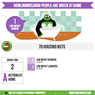

Tarsier - JS library for greenApes
==================================
This javascript library allows you to integrate widgets that display information for
users of greenApes (www.greenapes.com).

**NOTE**: The library is not ready for production yet, but it is in active development.

Tarsier supports the following browsers: Internet Explorer 8 and following, Firefox (current), Chrome (current), Safari 6.

### Quick tutorial

How to embed greenApes widgets into your website:

1. **Include the javascript**. You need to include the `tarsier.min.js` script in your page's head section.
   You can use our (SSL-only) CDN, or mirror locally:

   ```html
   <script src="https://greenapes.r.worldssl.net/tarsier/v0.2/tarsier.min.js"></script>
   ```

2. **Use our tags in your page**. Widgets can be embedded into the webpage through the usage of custom HTML
   tags, with prefix `ga:`. For instance:

   ```html
   <ga:info-tribe ape="me" date="2013/10/01 10:00:00" duration="10" topic="actions" animation="5000"></ga:info-tribe>
   ```

3. **Run Tarsier's replacement function**. When the page is loaded, call the `replace()` function on the
   global Tarsier object `T`. Tarsier will the populate all the `ga:` widgets:

   ```javascript
   T.replace();
   ```

   You can place this call in a `<script>` tag at the end of the page, or wrapping it in a jquery style
   `document.ready` callback.


### How to style ga nodes

The correct way to add style to ga tags is by applying CSS to both the nodes and classes with the same name:

```css
ga\:info-tribe {
    display:  inline-block;
    width:    645px;
    height:   645px;
    overflow: hidden;
    border:   1px solid #000;
}
```

**NOTE:** `:` is a special character in CSS and must be escaped with a `\` (backslash) when used in node and tags names.


IE8 support
-----------
If you need to support IE8, you need to alter your style a little. Instead of styling the custom class, which is not
supported, you need to style a class with an equivalent name, and with `_` in place of `:`:

```css
.ga_info-tribe {
	display: inline-block;
	width:645px;
	height:645px;
	overflow:hidden;
	border:1px solid #000;
}
```

This syntax is supported also in all other browsers, so you don't need to duplicate the CSS.

Available GA:TAGS
-----------------

### ga:info-tribe

This tag correspons to a widget showing the infograph of an ape's tribe. 

#### parameters:

 * ape: ID of the ape for which to show the infograph. Use ape="greenapes" to get the infopraph of the entire greenApes community
 * date: Select the start date for the infrograph. Format "YYYY/MM/DD" or "YYYY/MM/DD hh:mm:ss".
 * duration: time frame in days for the infograph
 * topic: [ actions | eating | housing | jungle | shopping | moving ]. Select which section of the infrograph is shown.
 * animation: [ none | delay in ms | manual ]. Decide which animation is used for the infograph:
   * None: no animation, the infograph is shown in its final complete format
   * Delay: the infograph automatically animates after the specified number of milliseconds.
   * Manual: the infograph waits for an event to begin animation. You need to send the even with the following code:

     ```javascript
     var g = document.getElementsByTagName("ga:info-tribe")[0];
     T.sendMessage(g, "animate!");
     ```


##### example of topic actions


##### example of topic eating


##### example of topic housing



##### example of topic shopping


#####example of topic jungle


