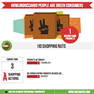

Tarsier - JS library for greenApes
==================================
This javascript library allows you to integrate widgets that display information for
users of greenApes (www.greenapes.com).

**NOTE**: The library is not ready for production yet, but it is in active development.

Quick tutorial
--------------
How to embed greenApes widgets into your website:

1. **Include the javascript**. You need to include the `tarsier.min.js` script in your page's head section.
   You can use our (SSL-only) CDN, or mirror locally:

   ```html
   <script src="https://greenapes.r.worldssl.net/tarsier/v0.1/tarsier.min.js"></script>
   ```

2. **Use our tags in your page**. Widgets can be embedded into the webpage through the usage of custom HTML
   tags, with prefix `ga:`. For instance:

   ```html
   <ga:info-tribe ape="me" month="05" topic="actions" animation="5000"></ga:info-tribe>
   ```

3. **Run Tarsier's replacement function**. When the page is loaded, call the `replace()` function on the
   global Tarsier object `T`. Tarsier will the populate all the `ga:` widgets:

   ```javascript
   T.replace();
   ```


   You can place this call in a `<script>` tag at the end of the page, or wrapping it in a jquery style
   `document.ready` callback.

Available GA:TAGS
-----------------

### ga:info-tribe
this tag is for the widget of a tribe's infographic

#### parameters:

* ape: 
* month:
* animation: [ none | delay in ms | manual | scroll ]

#### animate!

    if the animation attribute is set to manual, to start the chart animation you will have to send a message to the widget as below:

    ```javascript
    var g = document.getElementsByTagName("ga:info-tribe")[0];
    T.sendMessage(g, "animate!");
    ```


* topic: [ actions | eating | housing | jungle | shopping ]

##### example of topic actions


##### example of topic eating


##### example of topic home


##### example of topic shopping



#####example of topic jungle


About IE8
---------
Tarsier supports IE8 substituting HTML5 placeholder tags with div elements with class name = "html5 tag name":

```html
<ga:info-tribe ape="me" month="05" topic="actions" animation="5000"></ga:info-tribe>
```

will become like this on IE8:

```html
<div class="ga:info-tribe" ape="me" month="05" topic="actions" animation="5000"></ga:info-tribe>
```

keep in mind that when you write stylesheet, if you want to support IE8:

```css
.ga\:info-tribe,
ga\:info-tribe {
	display: inline-block;
	width:645px;
	height:645px;
	overflow:hidden;
	border:1px solid #000;
}
```
