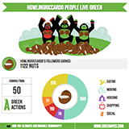
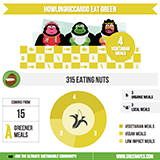

Tarsier - JS library for greenApes
==================================
This javascript library allows you to integrate widgets that display information for
users of greenApes (www.greenapes.com).

**NOTE**: The library is not ready yet, but it is in active development. Documentation will be added later.


Embed greenApes widgets in your page in 3 steps!!
----------------------------------------------------------
### 1. script

first of all, you need to include the tarsier.min.js script in your page head section.
Sure you can use the greenApes cdn if you want!

```html
<script src="https://greenapes.r.worldssl.net/tarsier/v0.1/tarsier.min.js"></script>
```

### 2. ga:tag

put the available tags in your html page:

```html
<ga:info-tribe ape="me" month="05" topic="actions" animation="5000"></ga:info-tribe>
```

### 3. replace!

when the page is loaded call the replace function. Tarsier will inserts the greenapes widgets into the ga:tags:

```javascript
T.replace();
```

this could be achieved putting this script in the bottom of the page or wrapping in a jquery style document.ready callback.


Available GA:TAGS
-----------------

### ga:info-tribe
this tag is for the widget of a tribe's infographic

#### parameters:

* ape: your greenapes username; for the global infograph use "greenapes"
* month: 2 digit number from 01 to 12 rapresenting a month
* animation: [ none | delay in ms | manual ]

    ##### animation = none:

    the widget will show the infograph as soon as it can
    
    ##### animation  = delay in ms:

    the widget will draw the infograph using an animation that will start after N ms from its laod is complete

    ##### animation = manual:

    the widget will not draw the infograph, the drawing animation can be started using sendMessage

    ##### animate!

    if the animation attribute is set to manual, to start the chart animation you will have to send a message to the widget as below:

    ```javascript
    var g = document.getElementsByTagName("ga:info-tribe")[0];
    T.sendMessage(g, "animate!");
    ```


* topic: [ actions | eating | housing | jungle | shopping ]

##### example of topic actions



##### example of topic eating



##### example of topic home


##### example of topic shopping


#####example of topic jungle


Use the library in your own project
-----------------------------------
The source code is splitted in 2 main files:

* tarsier.js
* handlers.js

### tarsier.js
contains helpers for DOM traversing and attributes reading.
### handlers.js
contains the handlers that will process the tag specified


```
T.registerHandler("YOUR TAG NAME", function(node){
    //node manipulation....
});
```

How to build
------------
```
npm install -g grunt-cli
```

requirements:

 - nodejs
 - npm

install grunt:
```
npm install -g grunt-cli
```

then from the project root folder
```
npm install
```

npm will install all the dependencies from package.json

To minify the library, from the project root folder

```
grunt uglify
```

It will save on build/widget.min.js the minified version of src/widget.js
